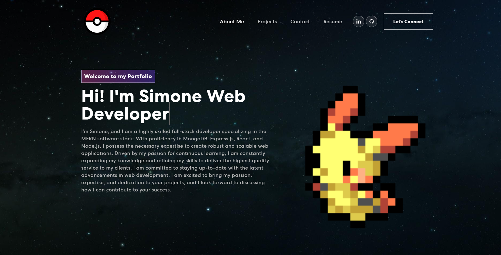

# Portfolio React

## Description

Welcome to my React Portfolio! Here, you'll find a showcase of my work and projects.

### Table of Contents

* [Installation](#installation)
* [License](#license)
* [Testing](#testing)
* [Questions](#questions)
* [Deployed Application](#deployed-application)

## Installation

You can access my React Portfolio by simply visiting the [Live Page](https://purplelume.github.io/Portfolio-react/). No installation is required.

## License

This project is licensed under the [MIT License](https://mit-license.org/).

## Testing

There are no specific tests needed for this portfolio.

## Questions

If you have any questions or would like to get in touch, please feel free to reach out:

- GitHub: [Purplelume](https://github.com/Purplelume)
- Email: simone.monari23@gmail.com

## Deployed Application

Explore my portfolio and get to know more about my work and projects by visiting the [deployed application](https://purplelume.github.io/Portfolio-react/).